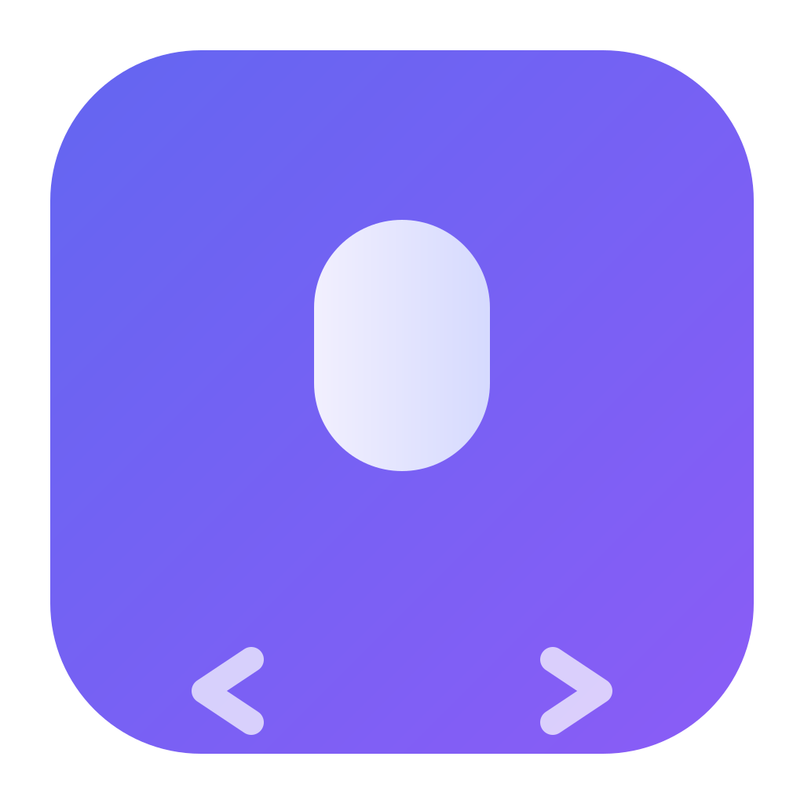
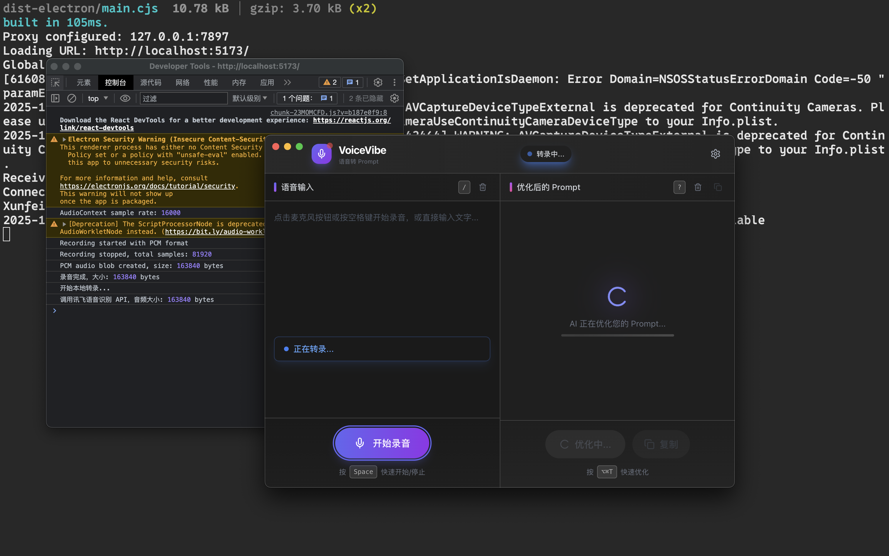

# VoiceVibe

<p align="center">
  
</p>

<p align="center">
  <strong>语音转 Prompt - 为 Vibe Coding 而生</strong>
</p>

<p align="center">
  把模糊的想法说出来，自动生成结构化的 AI 编程提示词
</p>

---

## 功能特点

- **语音输入** - 按空格键录音，松开自动转文字
- **智能优化** - 将口语化描述转换为结构化的编程提示词
- **一键复制** - 优化后自动复制到剪贴板，直接粘贴到 Claude Code / Cursor
- **全局快捷键** - `⌥⌘P` 随时呼出，不打断工作流
- **本地运行** - 桌面应用，响应迅速

## 截图

<p align="center">
  
</p>

## 安装

### macOS

1. 从 [Releases](https://github.com/Livia-Tassel/voicevibe/releases) 下载最新的 `.dmg` 文件
2. 打开 DMG，将 VoiceVibe 拖入 Applications 文件夹
3. 首次打开时，右键点击应用选择"打开"（绕过 Gatekeeper）

### 从源码构建

```bash
# 克隆仓库
git clone https://github.com/Livia-Tassel/voicevibe.git
cd voicevibe

# 安装依赖
npm install

# 开发模式
npm run dev

# 构建安装包
npm run build
```

## 配置

首次使用需要配置 API：

### 1. 语音识别 API（讯飞）

1. 访问 [讯飞开放平台](https://console.xfyun.cn/services/iat)
2. 注册账号并创建应用
3. 获取 AppID、APIKey、APISecret
4. 在设置中填入

### 2. Prompt 优化 API

支持任何兼容 OpenAI API 格式的服务：
- OpenAI API
- Claude API（通过兼容层）
- 其他第三方 API 服务

在设置中填入 API Key、API 地址和模型名称。

## 快捷键

| 快捷键 | 功能 |
|--------|------|
| `⌥⌘P` | 显示/隐藏窗口 |
| `Space` | 开始/停止录音 |
| `⌥⌘T` | 优化 Prompt |
| `/` | 聚焦输入框 |
| `?` | 聚焦输出框 |
| `ESC` | 取消聚焦 |

## 工作流程

```
说话 → 语音识别 → 智能优化 → 复制 → 粘贴到 AI 助手
```

**示例：**

输入（语音）：
> "帮我做一个可以记录每天心情的小程序"

输出（优化后）：
> 帮我创建一个心情日记小程序。
>
> 技术栈：微信小程序 + 云开发
>
> 功能需求：
> 1. 每日心情记录，支持选择心情等级和添加文字描述
> 2. 日历视图展示历史心情
> 3. 心情统计图表
> ...

## 技术栈

- **Electron** - 跨平台桌面应用
- **React 18** - 用户界面
- **TypeScript** - 类型安全
- **Tailwind CSS** - 样式
- **Vite** - 构建工具
- **讯飞 API** - 语音识别
- **OpenAI API** - Prompt 优化

## 开发

```bash
# 安装依赖
npm install

# 启动开发服务器
npm run dev

# 类型检查
npm run typecheck

# 构建生产版本
npm run build
```

## 许可证

MIT License

## 致谢

- [讯飞开放平台](https://www.xfyun.cn/) - 提供语音识别服务
- [Electron](https://www.electronjs.org/) - 跨平台桌面应用框架
- [Vite](https://vitejs.dev/) - 下一代前端构建工具
